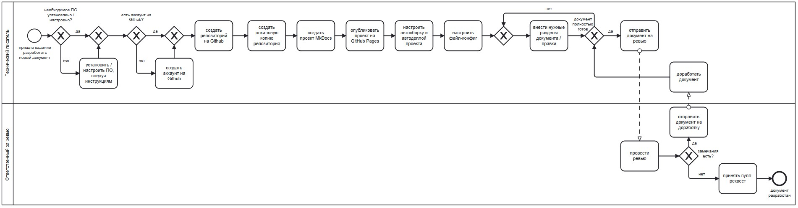

# 1. Docs-as-code: понятие, особенности, принципы  

1.1. **Docs-as-code** (от англ. Documentation as code — «Документация как код») — это подход к созданию и работе с документацией, который основан на принципах и практиках разработки программного обеспечения (ПО).  

1.2. Создание технической документации в рамках подхода docs-as-code подразумевает использование техническим писателем инструментов и подходов разработки кода, а именно:  

- писать документацию на [языке разметки](tools/markupLanguage.md) в спецредакторе, а не в формате WYSIWYG;  
- хранить документацию в [системе контроля версий](tools/git.md);  
- собирать документацию в нужный выходной формат при помощи [генератора статических сайтов](tools/ssg.md).  

1.3. Ключевые принципы подхода docs-as-code:  

- **KISS** *(от англ. Keep it simple, stupid или Keep it short & simple — «Пиши проще, глупец, или Пиши кратко и просто»)*. Излагать информацию кратко и просто, не используя канцеляризмы, сленг, профессиональный жаргон;  
- **DRY** *(от англ. Don't repeat yourself — «Не повторяйся»)*. Избегать дублирования информации, хранить единственный источник истины;  
- **YAGNI** *(от англ. You aren’t gonna need it — «Тебе это не понадобится»)*. Не описывать лишнего и отказаться от избыточной функциональности.  
- **SLAP** *(от англ. Single level of abstraction principle — «Принцип единого уровня абстракций»)*. Разделять информацию на уровни абстракций так, чтобы в отдельном разделе находился текст, касающийся единого уровня абстракции;  
- **SRP** *(от англ. Single responsibility principle — «Принцип единой ответственности»)*. Составлять абзацы так, чтобы в одном абзаце раскрывалась одна мысль;  
- **LoD** *(от англ. Law of Demeter — «Закон Деметры»)*. Ссылаться только на релевантные документы и разделы этого же документа;  
- **OPУ** *(Один раз увидеть)*. Визуализировать данные через диаграммы, схемы, графики, скриншоты, чтобы помочь сориентироваться в сложных процессах;  
- **ABC** *(от англ. Author, be consistent — «Автор, будь последовательным»)*. Соблюдать консистентность в составлении и оформлении текста (единый стиль, тон, голос, цветовая гамма, шрифты, отступы и т.д.).  

1.4. Процесс разработки технической документации в рамках подхода docs-as-code в организации выглядит так:  

