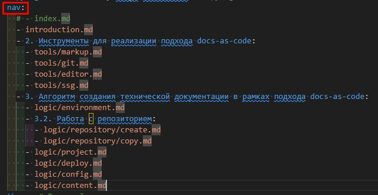

# 3.6. Наполнение контентом
1) Создайте новую ветку, выполнив в терминале VS Code команду `git checkout -b название_ветки`. Назовите ветку с учетом [требований](../tools/git.md/#225).  
2) Определитесь со структурой технической документации с учетом следующих требований:

- все файлы, из которых состоит техническая документация, хранятся в папке docs;  
- вложенность файлов в папки определяет структуру технической документации;  
- все папки вне зависимости от вложенности должны иметь индексный файл index.md. Он может быть пустым;  
- для названия файлов используются латиница и цифры. Название, состоящее из нескольких слов, оформляется CamelCase. То есть слова пишутся слитно, каждое следующее слово начинается с прописной буквы.  

3) Внесите текст, составляющий разделы технической документации, в соответствии с задуманной структурой.  
4) В ходе работы [индексируйте и коммитьте](../tools/git.md/#224) изменения по мере выполнения задач.  
5) В значение ключа `nav` в файле `mkdocs.yml` перечислите файлы, текст которых составляет разрабатываемую техническую документацию, в порядке, предусмотренном структурой проекта.  
??? example "Пример оформления `nav` в файле `mkdocs.yml`"
    
6) После того, как вся работа в ветке будет завершена, [перенесите изменения](../tools/git.md) из локальной копии в репозиторий, воспользовавшись функционалом вкладки **Source control** или последовательно выполнив команды:  
`git add .`  
`git commit -m "название_коммита"`  
`git push -u origin название_ветки`  
7) Запросите [пулл-реквест](../tools/git.md/#226).  
После того, как ветка технического писателя вольется в главную ветку, текст технической документации на сайте обновится автоматически.