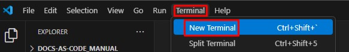

# 3.3. Создание проекта MkDocs

1. Откройте локальную копию репозитория в VS Code.  
2. Откройте новый терминал в верхней панели инструментов:  
  
3. Выполните в терминале команду `mkdocs new .`.
MkDocs вложит в существующую папку файлы в следующем порядке:  
  
- папка *docs* нужна для хранения файлов текстов, из которых будет собираться документация. Каждый файл — отдельная страница будущего сайта;
- *mkdocs.yml* — это конфигурационный файл, в котором прописывают настройки сайта.  
4. Перенесите изменения из локальной копии в репозиторий, воспользовавшись функционалом вкладки **Source control** или последовательно выполнив в терминале команды:  
`git add .`  
`git commit -m "создан проект MkDocs"`  
`git push`  

