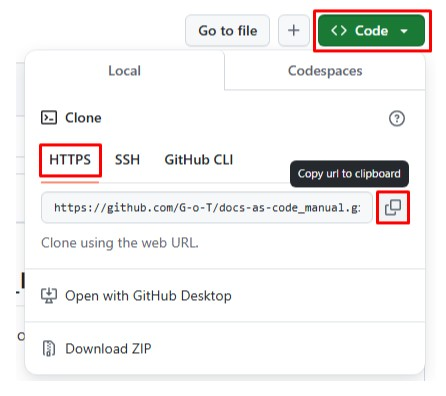

# 3.2.2. Создание локальной копии репозитория

1) Определите папку на вашем компьютере, где будет храниться локальная копия репозитория, и перейдите в нее в командной строке.  
2) Клонируйте удаленный git-репозиторий в выбранную папку. Для этого:  

- со страницы репозитория по нажатию на **< > Code** на вкладках **Local** =>  **HTTPS** скопируйте URL репозитория:
  
- в командной строке выполните команду `git clone url_репозитория`.