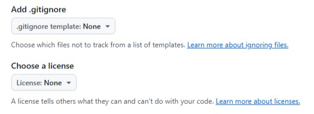

# 3.2.1. Создание репозитория в GitHub
1) Войдите в аккаунт GitHub.  
2) В верхнем правом углу нажмите ➕ и выберите **New repository**.  
  
3) Заполните обязательное поле появившейся формы — **Repository name** (Имя репозитория). Это название репозитория, которое отражает суть, размещенной в нем документации.  
Используйте для названия латиницу, цифры и символы: точка, дефис, нижнее подчеркивание.  
  
4) Заполните **Description** (Описание репозитория). В нем кратко укажите суть размещаемого в репозитории документа.  
  
5) Выберите тип репозитория **Public**.  
6) Выберите добавление файла **Readme**.  
  
7) Оставьте настройки добавления файла `.gitignore` и выбора лицензии по умолчанию.  
  
8) Нажмите **Create repository**.
