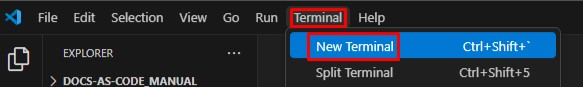
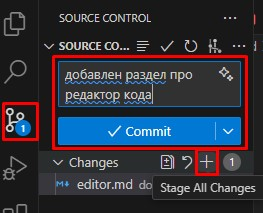

# 2.3. Редактор, поддерживающий Markdown, HTML и работу с Git

## 2.3.1. Редактор текста как кода: понятие и примеры
**Редактор** — это ПО, в котором можно создавать и редактировать тексты, используя нужные языки разметки, а также работать с Git.  

??? example "Примеры"  
    - Visual Studio Code  
    - Sublime Text  
    - Atom  

## 2.3.2. Используемый текстовый редактор
Техническая документация создается в редакторе кода *Visual Studio Code* (далее — VS Code).

## 2.3.3. Основы VS Code
Все изменения вносимые в файлы через VS Code надо сохранять. Это можно делать вручную по нажатии Ctrl + S / ⌘ + S, но лучше настроить автоматическое сохранение. Для этого во вкладке **File** надо выбрать **Auto save**.  

VS Code позволяет взаимодействовать с Git. Делать это можно двумя способами:

=== "Через терминал VS Code"
    1. Откройте новый терминал в верхней панели инструментов:  
      

    2. Введите нужную команду Git в терминале и нажмите **Enter**  

=== "Во вкладке **Source control**"
    1. Откройте вкладку **Source control** (Контроль версий).
    2. Выполните необходимые действия.

    ??? example "Как перенести изменения из локальной копии в репозиторий"
        1. Чтобы добавить изменения в индекс Git, нажмите ➕.
        2. Чтобы закоммитить изменения, введите название коммита и нажмите **Commit**:
          
        3. Чтобы запушить изменения, нажмите **Sync Changes**.