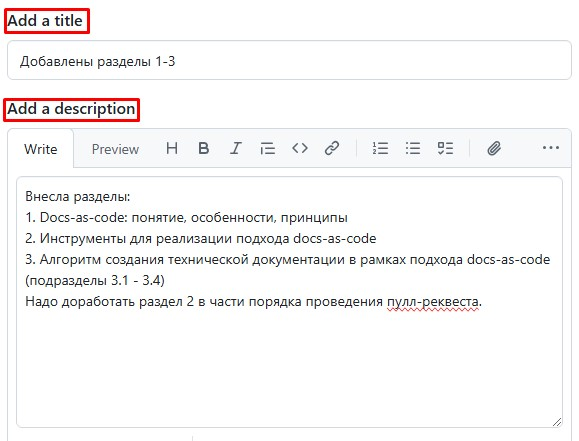

# 2.2. Система контроля версий и веб-сервис для работы с ней

## 2.2.1. Система контроля версий: понятие и примеры

**Система контроля версий** — это ПО, которое позволяет отслеживать и контролировать изменения в тексте, управлять различными версиями проекта, синхронизировать работу нескольких человек над одним файлом, а также автоматизировать сборку, тестирование и деплой проекта.  

??? example "Примеры"  
    - Git  
    - Subversion  
    - Mercurial  

Зачастую, чтобы использовать систему контроля версий, нужен подходящий для нее веб-сервис, который обеспечивает графический интерфейс для работы с этой системой, а также облачное хранилище для использующих ее проектов.  

??? example "Примеры веб-сервисов для Git"  
    - GitHub  
    - GitLab  
    - Bitbucket  

## 2.2.2. Используемые система контроля версий и веб-сервис для работы с ней

Техническая документация создается с использованием *Git* и *Github*.  

## 2.2.3. Основы Git и GitHub

**Git** — это распределенная система контроля версий.  

Работа с Git строится на следующих моментах:  

- весь проект хранится в удаленном репозитории на сервере.   
**Репозиторий** — это совокупность файлов, находящихся под контролем версий, с историей их изменений и служебной информацией;  

- технические писатели работают с локальными копиями репозитория и отправляют внесенные изменения на сервер, чтобы обновить оригинал проекта;  

- основная версия документа хранится на главной ветке репозитория. При работе с какой-то частью документа (создании нового раздела) технический писатель не использует главную ветку, а создает новую отдельную ветку. В ней сохраняются в хронологической последовательности все внесенные им изменения. После того, как работа полностью окончена, ветка технического писателя сливается с главной веткой. Следовательно, основная версия документа обновляется, в нее вносятся коррективы технического писателя;  

- чтобы изменения проекта зафиксировались в ветке, их надо добавить в индекс Git, а затем закоммитить.  
**Индекс Git** — это промежуточная область, в которой хранятся изменения файлов на пути от локальной копии до оригинального репозитория.   
**Коммит** (от англ. commit  — «фиксировать») — это событие в истории ветки, которое выполняется по спецкоманде и фиксирует произошедшие в ветке правки, которые были добавлены в индекс Git;  

- чтобы локальные изменения отправились на удаленный репозиторий, их надо запушить.  
**Пуш** (от англ. push — «толкать») — это процесс, в ходе которого содержимое локальной копии загружается в репозиторий;  

- чтобы слить ветку технического писателя с главной веткой репозитория, надо сделать пулл-реквест.  
**Пулл-реквест** (от англ. pull-request — «запрос на включение») — это запрос на слияние веток, в ходе которого проверяется нет ли противоречий между ними. Если конфликтов нет, ветка технического писателя вольется в главную ветку репозитория. Если конфликты есть — слияние веток возможно только после разрешения конфликтов.  

**GitHub** — это веб-сервис для хостинга Git-репозиториев, статических сайтов GitHub Pages и автоматизации сборки GitHub Actions.  
**GitHub Pages** — это часть веб-сервиса GitHub, которая предусмотрена для бесплатного размещения статических сайтов в интернете.  
**GitHub Actions** — это часть веб-сервиса GitHub, которая позволяет автоматизировать конвейер сборки, тестирования и развертывания.  

## 2.2.4. Взаимодействие с Git

<table border="1">
    <thead>
        <tr>
            <th>Процесс</th>
            <th>Назначение команды</th>
            <th>Команда</th>
        </tr>
    </thead>
    <tbody>
        <tr>
            <td colspan="2">Просмотр статуса файлов в локальной копии репозитория</td>
            <td><code>git status</code></td>
        </tr>
        <tr>
            <td colspan="2">Обновление локальной копии репозитория</td>
            <td><code>git pull</code></td>
        </tr>
        <tr>
            <td rowspan="3">Перенос изменений из локальной копии в репозиторий</td>
            <td>Добавить изменения в индекс Git</td>
            <td><code>git add .</code></td>
        </tr>
        <tr>
            <td>Закоммитить изменения</td>
            <td><code>git commit -m "суть изменений"</code></td>
        </tr>
        <tr>
            <td>Запушить изменения</td>
            <td><code>git push</code>  или  <code>git push -u origin название_ветки</code> — если это первый пуш новой ветки</td>
        </tr>
        <tr>
            <td rowspan="3">Создание новой ветки и взаимодействие с ней</td>
            <td>Создать новую ветку</td>
            <td><code>git branch название_ветки</code></td>
        </tr>
        <tr>
            <td>Переключиться на ветку</td>
            <td><code>git switch название_ветки</code></td>
        </tr>
        <tr>
            <td>Создать новую ветку и переключиться на нее</td>
            <td><code>git checkout -b название_ветки</code></td>
        </tr>
    </tbody>
</table>

## 2.2.5. Оформление веток и коммитов

- Для наименования ветки используйте латиницу, цифры и нижнее подчеркивание
- Название ветки должно отражать суть производимой в ней работы и начинаться со слов:  

  - `create` - cоздание документа;  
  - `add` - добавление разделов в уже существующий документ;  
  - `fix` - исправление ошибок;  
  - `edit`- редактирование структуры документа;  
  - `style` - внесение изменений, касающихся стилизации и форматирования.  

- Сообщение коммита пишите на русском языке.
- Сообщение коммита должно отражать суть вносимых изменений и начинаться на причастие.

## 2.2.6. Пулл-реквест и слияние веток
Чтобы сделать пулл-реквест:  
1. Откройте репозиторий в GitHub;  
2. Нажмите **Compare & pull request**:  
  
3. Проверьте, чтобы в разделе сравнения изменений в поле `base` была указана главная ветка `main`, а в поле `compare` — ветка, которую надо слить с главной;  
4. Добавьте заголовок пулл-реквеста и его описание. Заголовок должен кратко отражать суть изменений, а описание — содержать более детальную информацию о вносимых коррективах:  
  
5. Нажмите **Create pull request**.  
Система проверит ветки на наличие конфликтов, и, если их нет, позволит слить ветки.  
6. Чтобы слить ветки, нажмите **Merge pull request** и **Confirm merge**.  

!!! abstract "Если документ создается в команде - после создания пулл-реквеста отправьте изменения на ревью"  
    Чтобы привлечь к ревью рецензента, в правой панели нажмите ⚙️ и выберите ответственного.  
    Рецензент проверит выполнение задачи и при необходимости оставит замечания в виде комментариев.  
    Если такие комментарии есть, внесите соответствующие правки или оспорьте замечания, ответив на комментарии.  
    После окончательного согласования правок, ответственный примет пулл-реквест и ветка технического писателя вольется в главную.  

